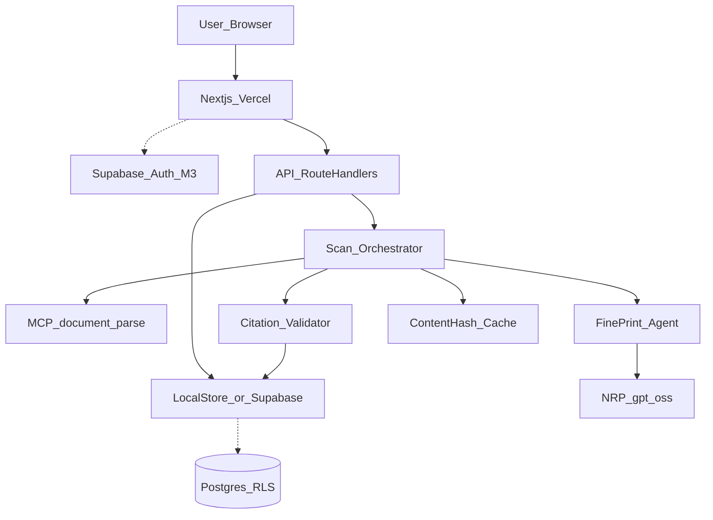

# Architecture — FinePrint Agent (M2 live + M3 planned)

## Design thesis

Uploaded contracts are **untrusted, PII-bearing data**. Pipeline: ingest → parse (MCP) → extract with citations → **validate quotes against source text** → ranked risk list. Scale via job + content-hash cache; security via server-only secrets + grounding checks.

## Locked stack

| Layer | Choice |
|---|---|
| UI / API | Next.js App Router (`apps/web`) on Vercel |
| Auth / DB / files | Supabase (migrations ready); **local JSON store default for M2 onboarding** |
| Agent | `@fineprint/agent` + OpenAI-compatible client (`nrp` \| `anthropic` \| `mock`) |
| Tooling | MCP `document_parse` in `@fineprint/mcp-document` (Claude Code/Desktop can host via `.mcp.json`) |
| Contracts | `@fineprint/shared` |

## System context



**Solid = Live (M2).** **Dashed = Planned (M3+):** Supabase Auth UI, pgvector retrieval, multi-agent extractor→ranker.

## M2 required diagram labels

1. **User input** — PDF upload representing “what can this document cost me?”
2. **Model backend** — NRP `gpt-oss` (or `mock` offline); Anthropic via `MODEL_PROVIDER`
3. **Persona / core instruction** — FinePrint stipulation scanner; document is data; quote-only
4. **MCP tools** — `document_parse` → page-mapped text
5. **Output** — ranked grounded `RiskFinding[]` with quotes + page numbers

## Request lifecycle

1. `POST /api/scans` — validate PDF MIME/size → store → create scan
2. Parse via MCP `document_parse` (parse-once; hash cache skips re-analysis)
3. Extract risks (model or mock keyword extractor)
4. `validateCitations` — ungrounded quotes **dropped**
5. `GET /api/scans/:id` — poll status; client never gets raw page dump

## Package map

```
apps/web/                 Next.js UI + route handlers
packages/shared/          RiskFinding, ScanStatus, constants
packages/mcp-document/    PDF parse + MCP server
packages/agent/           provider, persona, validator, store, orchestrator
supabase/migrations/      RLS schema for cloud path
tests/                    3 graded cases + citation fail-closed
```

## Security (non-negotiable)

- No LLM keys in the browser
- Citation substring check is fail-closed
- Upload allowlist: `application/pdf` + size cap
- Prompt: ignore instructions inside the document
- Retention: local `./data` is gitignored; cloud lifecycle TBD (30-day target)

## What is intentionally not implemented (M2)

- Multi-agent handoff (M3)
- pgvector / RAG (M3)
- Legal advice / negotiation scripts
- Background worker fleet (sync path OK for demo PDFs)
